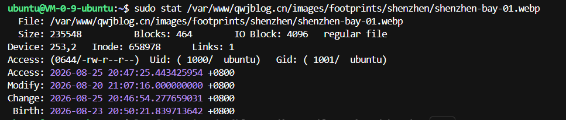
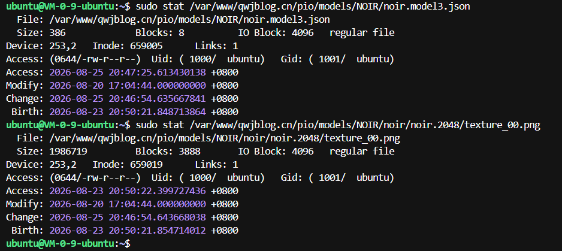
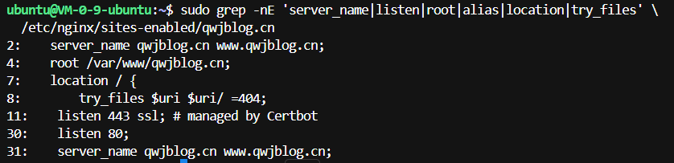
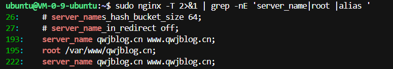
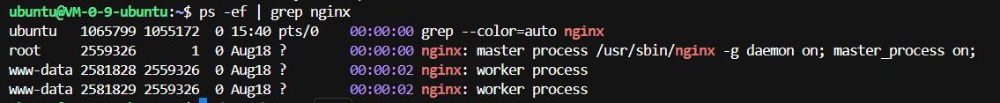

# 足迹中的图片和看板娘无法显示的问题

博客部署上线以后，我很快又发现了一些问题。

足迹页面里，点亮城市所记录的照片打不开，看板娘也没有正常出现。

一开始我以为是本机上的文件没有被包含进 `dist`，但是回到项目里检查时，发现对应文件明明都在。

于是又开始了一轮排查。

---

## 一、先确认文件到底有没有上传

后来我开始怀疑，是不是压缩包上传到服务器以后，解压时出了问题。

所以第一步就是确认这些文件到底有没有进入正式网站目录：

```text
/var/www/qwjblog.cn
```

### 1. 确认浏览器请求的真实资源地址

我随机打开了一个足迹页面：

[https://www.qwjblog.cn/footprints/shenzhen/#footprint-shenzhen-3](https://www.qwjblog.cn/footprints/shenzhen/#footprint-shenzhen-3)

不过这个只是页面地址，并不是照片本身的地址。

想确认浏览器真正请求了哪个文件，可以按 `F12` 打开开发者工具：

1. 打开“网络 / Network”。
2. 刷新页面。
3. 选择“Img / 图片”。
4. 找到标红或者返回 404 的请求。
5. 查看它的 `Request URL`。

可能会看到：

```text
https://www.qwjblog.cn/images/footprints/shenzhen/shenzhen-bay-01.webp
```

（这里说“可能”，是因为我当时直接复制了照片链接，也得到了这个地址，并没有使用 F12 这个方法。）

还可以右键损坏的图片检查 HTML：

```html

```

当然，也可以先回到本机项目里找一下对应目录。

### 2. 到服务器上检查文件

知道真实路径后，我先检查照片是否存在：

```bash
sudo stat /var/www/qwjblog.cn/images/footprints/shenzhen/shenzhen-bay-01.webp
```



`stat` 正常列出了文件大小、权限和修改时间，说明照片确实已经在服务器上。

然后再检查一下看板娘相关文件。因为一开始不知道它们的路径，我先从本机项目里找到了文件位置：

```bash
sudo stat /var/www/qwjblog.cn/pio/models/NOIR/noir.model3.json
sudo stat /var/www/qwjblog.cn/pio/models/NOIR/noir/noir.2048/texture_00.png
```



这两个文件也都存在。

`stat` 可以理解成：查看最后指定的那个文件。如果文件存在，它就列出状态和详细属性；如果不存在，就会提示找不到。

到这里至少可以确定一件事：

> 照片和看板娘文件并没有在构建、压缩、上传或者解压时丢失。

---

## 二、再确认 Nginx 的网站目录

其实其他页面都能正常打开，按理说 Nginx 的基本配置大概率没有问题。

不过当时为了求稳，我还是检查了一遍。

我查到了下面两个命令，第一个直接查看当前站点配置：

（这两个命令都是搜出来的，有点复杂了。）

```bash
sudo grep -nE 'server_name|listen|root|alias|location|try_files' \
  /etc/nginx/sites-enabled/qwjblog.cn
```



另一个命令查看 Nginx 展开后的完整配置：

```bash
sudo nginx -T 2>&1 | grep -nE 'server_name|root |alias '
```



两个结果都指向：

```text
root /var/www/qwjblog.cn;
```

所以 Nginx 使用的正式网站目录没有找错，相关配置也正常。

---

## 三、最后发现是目录权限

文件存在，Nginx 的 `root` 也正确，那就只能继续往路径本身查了。

### 1. 逐级检查整条路径

最后关键的一步，是依次检查整条路径上每一级目录的权限：

```bash
namei -l /var/www/qwjblog.cn/images/footprints/shenzhen/shenzhen-bay-01.webp
```

`namei` 会把路径逐级拆开检查，`-l` 用来显示每一级的详细权限。

结果在 `shenzhen` 这一层发现了问题：

```text
drw-r--r-- ubuntu ubuntu shenzhen
Permission denied
```

直接存放照片的目录权限居然是 `644`。

> ⭐ **这里是这次排查最容易混淆的地方：文件的 644 很常见，但目录不能只照搬 644。**

对于普通文件：

```text
644 = rw-r--r--
```

通常表示所有者可以读写，其他用户只读。

但是对于目录，`x` 不是“执行一个程序”，而是“进入和穿过这个目录”。目录如果没有 `x` 权限，就算能看到目录名，也无法继续访问里面的文件。

`shenzhen` 当时是：

```text
drw-r--r--
```

这意味着所有者、所属组和其他用户都没有 `x`。真正处理网页请求的 Nginx 用户自然也进不去。

之前 `sudo stat` 之所以还能看到文件，并不是因为普通权限没有问题，而是因为 `sudo` 让命令以 root 身份运行了。

### 2. 确认 Nginx 到底以哪个用户读取文件

接下来我又检查了 Nginx 进程：

```bash
ps -ef | grep nginx
```



结果里可以看到：

- `root` 运行 Nginx 主进程，负责管理工作进程、读取配置和绑定端口。
- 真正处理网页请求、读取图片的是 `www-data` 工作进程。

`www-data` 既不是 `ubuntu` 用户，也不属于这个目录的所有者。它在 `shenzhen` 目录上只有 `r--`，缺少进入目录所必需的 `x`，所以照片虽然存在，Nginx 还是无法读取。

看板娘那一部分的问题也是同样的原因。

### 3. 换成 www-data 实际测试

为了再验证一次，我让命令直接以 `www-data` 身份检查照片：

```bash
sudo -u www-data test -r /var/www/qwjblog.cn/images/footprints/shenzhen/shenzhen-bay-01.webp \
  && echo "Nginx 可以读取" \
  || echo "Nginx 无法读取"
```

结果是：

```text
Nginx 无法读取
```

这样就基本可以确定，问题确实出在目录权限，而不是文件缺失或者 Nginx 路径错误。

---

## 四、修复目录和文件权限

先单独修复照片目录：

```bash
sudo chmod 755 /var/www/qwjblog.cn/images/footprints/shenzhen
```

也就是把目录从：

```text
rw-r--r--
```

改成：

```text
rwxr-xr-x
```

这样其他用户虽然不能修改目录，但可以进入目录并读取里面允许公开的文件。

看板娘相关目录同理，也需要保证整条路径上的每一级目录都有合适的 `x` 权限。

### 当时最终采用的整站修复

为了把网站里同类的权限问题一次处理掉，我当时最后执行的是：

```bash
sudo find /var/www/qwjblog.cn -type d -exec chmod 755 {} \;
sudo find /var/www/qwjblog.cn -type f -exec chmod 644 {} \;
```

第一条把所有目录设置为：

```text
rwxr-xr-x
```

第二条把所有普通文件设置为：

```text
rw-r--r--
```

对于公开的静态网站，这是一组很常见的权限：目录需要 `x` 才能进入，网页、图片等普通文件只需要让 Nginx 读取。

不过 `find` 是整站批量修改，范围比较大。以后再遇到类似问题，我还是应该先确认目标目录，避免把不该公开读取的配置、私钥或其他敏感文件也一起改成 `644`。

### 避免下一次部署又出现同样的问题

回头看，这次很可能是从 Windows 压缩、Linux 解压，再用 `rsync -a` 同步时，把临时目录里不合适的权限也一起保留到了网站目录。

以后部署静态文件时，可以考虑在 `rsync` 阶段明确指定目录和文件权限：

```bash
sudo rsync -av --delete --chmod=D755,F644 \
  ~/qwjblog-upload/ /var/www/qwjblog.cn/
```

这里：

```text
D755 = 目录使用 755
F644 = 普通文件使用 644
```

这样可以避免下一次更新后，某些目录又莫名其妙变成 `644`。

---

## 这次排查的整体思路

最后把整个过程重新顺一遍：

```text
照片和看板娘同时失效
↓
怀疑静态资源没有被包含进 dist
↓
本机检查后发现文件存在
↓
sudo stat 检查服务器正式目录
↓
确认上传后的文件也存在
↓
检查 Nginx root
↓
确认正式目录是 /var/www/qwjblog.cn
↓
namei -l 逐级检查完整路径
↓
发现 shenzhen 目录是 644，缺少 x 权限
↓
ps -ef | grep nginx
↓
确认真正读取文件的是 www-data
↓
目录改为 755，普通文件改为 644
↓
照片和看板娘恢复正常
```

这次最容易把我带偏的地方，就是：

> 文件确实存在，不代表 Nginx 就一定能读到。

之前我看到 `sudo stat` 能列出文件，就一直觉得上传应该没有问题。后来才明白，root 能读和 `www-data` 能读，完全是两回事。

后续会把服务、用户、进程好好讲讲：为什么是 `www-data` 去访问 `/var/www/qwjblog.cn/...` 呢？
